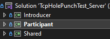
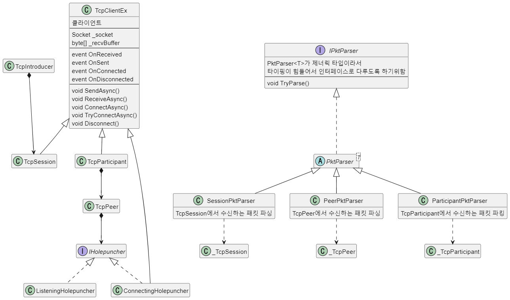
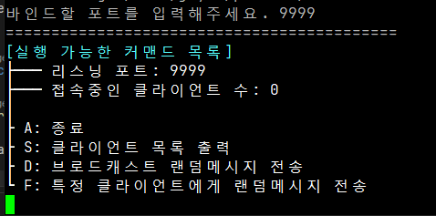
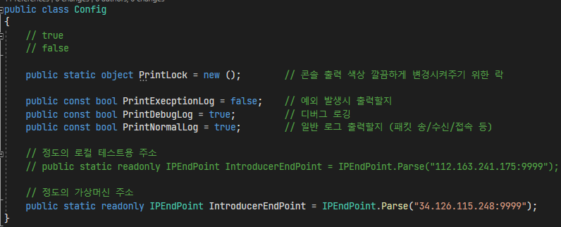
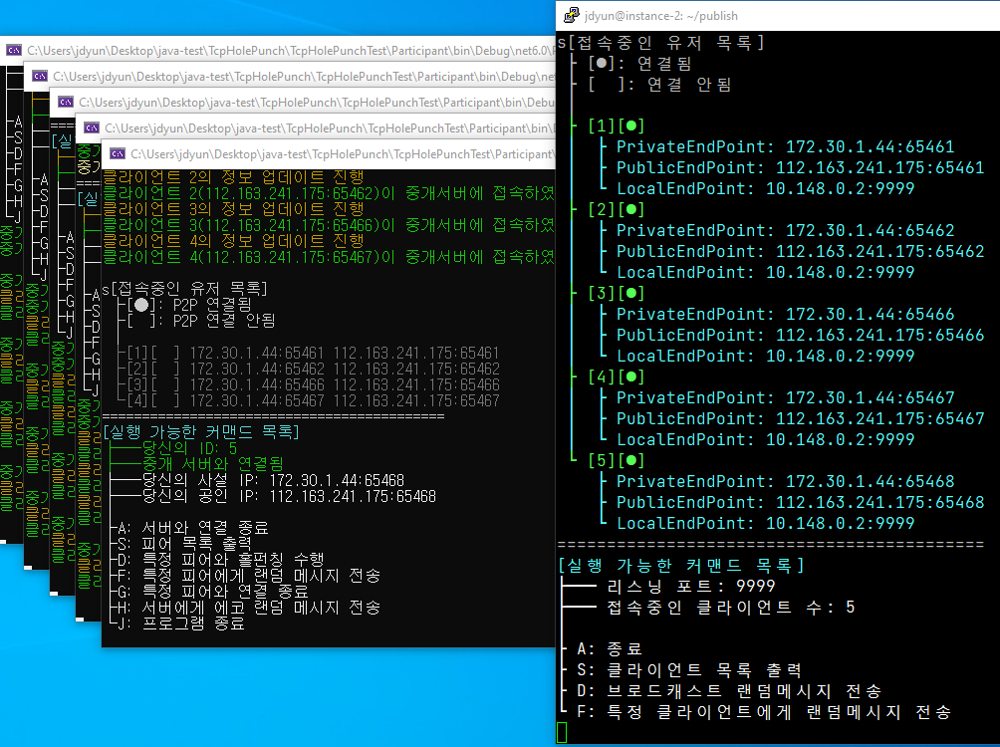
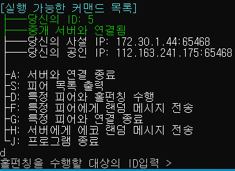
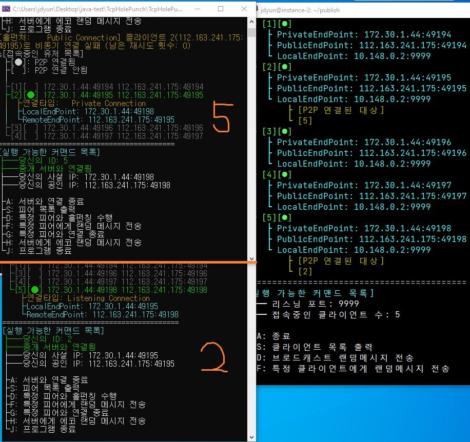
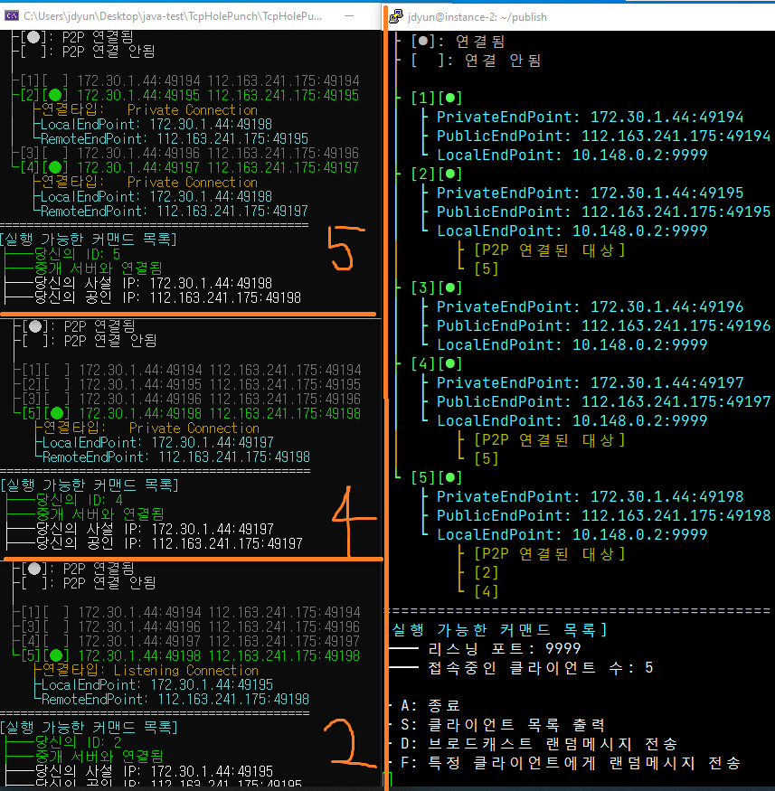

### 1. <a href="#_1" id="li_1">시작 배경과 목표</a>
### 2. <a href="#_2" id="li_2">개발 환경</a>
### 3. <a href="#_3" id="li_3">프로젝트 구조</a>
### 4. <a href="#_4" id="li_5">클래스 구조</a>
### 5. <a href="#_5" id="li_5">실행 방법</a>
1. <a href="#_5_1" id="li_5_1">중개 서버 실행 방법</a>
2. <a href="#_5_2" id="li_5_2">클라이언트 실행 방법</a>
3. <a href="#_5_3" id="li_5_3">홀펀칭 테스트 방법</a>
### 6. <a href="#_6" id="li_6">동작 원리</a>
### 7. <a href="#_7" id="li_7">학습 자료</a>

<br>
<br>
<br>

## 1. 시작 배경과 목표 <a href="#_1" id="_1"></a>

[브라이언 포드의 P2P 번역본](https://github.com/yjd6808/_YJD_BF_p2pnat)을 보고나서 한번 아무런 힌트없이 구현해보고 싶어서 진행한 
프로젝트이다. 홀펀칭조차 구현해본적이 없어서 먼저 UDP 홀펀칭을 구현해볼까 싶었는데 머릿속으로 견적을 내보니까 구현이 별로 어려워보이지 않았고 내가 이후 만들고자 하는 P2P 네트워킹 프로그램이 좀더 안정성있는 프로토콜 위에서 동작해야 하기 때문에 TCP 홀펀칭을 구현해보기로 했다.

---

<br>

목표1. NAT TCP 홀펀칭 기술을 활용한 P2P 통신을 구현한다.  
목표2. 깔끔한 콘솔 UI를 구성해서 클라이언트는 P2P 연결된 상대 클라이언트 정보를 한눈에 알 수 있도록 한다.  
목표3. 클래스 구조를 설계해서 제대로 동작하든지 말든지 간에 내가 설계한 구조대로 100% 구현해낸다. (실패할 경우 답지를 볼 것)  


<br>
<br>
<br>


## 2. 개발 환경 <a href="#_2" id="_2"></a>


[준비물]

1. <b>비주얼 스튜디오 2022 .NET 6.0</b>  
C# 언어를 사용해서 구현을 했는데 C++보다 아무래도 코드 작성이 더 쉽기 때문이다.
기본적으로 모든 프로그래밍은 비주얼 스튜디오로 진행한다.

2. <b>P2P 연결을 진행할 클라이언트 컴퓨터 1대이상</b>  
클라이언트 프로그램을 여러개 실행해서 P2P 연결을 테스트하기 위해서 필요하다.

3. <b>공인망에 위치한 서버용 컴퓨터</b>  
공인망에 컴퓨터를 두고 거기서 랑데부 서버(중개 서버)프로그램을 실행한 후 실제 테스트를 진행해야한다.  
이전에 메모리 오더링 테스트를 하면서 사용했던 울형 계정으로 만든 구글 클라우드 가상 머신 무료기간이 1달가까이 남아서 이걸 또 쓰기로 했다.  
데비안 리눅스 운영체제라서 비주얼 스튜디오에서 빌드할 경우 윈도우기반의 프로그램이 만들어지기 때문에 dotnet CLI를 사용해서 데비안 리눅스에서 실행가능한 프로그램으로 새로 빌드를 해서 배포해줘야한다.


<br>
<br>
<br>


## 3. 프로젝트 구조 <a href="#_3" id="_3"></a>


  

<br>

Introducer, Participant, Shared 이렇게 총 3개의 프로젝트로 구성되어 있다.
- Introducer: 중개 서버 프로그램으로 접속한 클라이언트간 P2P 매칭을 도와준다.
- Participant: 클라이언트 프로그램으로 P2P 연결을 직접 수행한다.
- Shared: 공용 라이브러리로 Introducer, Participant 프로젝트에서 참조하여 사용한다.


<br>
<br>
<br>

## 4. 클래스 구조 <a href="#_4" id="_4"></a>

내가 머릿속으로 제일 처음 떠올린 구조이다.  
전부 만들고나서 이게 완벽하게 "들어맞는" 구조는 아님을 알 수 있었다.  
그래도 내가 생각한대로 100% 동작해서 만족스럽고 TCP 홀펀칭 기술도 구현하는데 지장없는 구조임을 확인할 수 있었다.




<br>
<br>
<br>
<br>

## 5. 실행 방법 <a href="#_5" id="_5"></a>

비주얼 스튜디오 2022 .Net 6.0 기반 프로젝트이다.  

1. Introducer 프로젝트를 빌드 후 EC2같은 가상머신에서 배포 후 실행시키거나 다른 외부망의 컴퓨터에 설치한 후 실행한다.
2. Participant 프로젝트를 빌드해서 서로 다른 컴퓨터에서 실행 한 후 제공하는 커맨드라인을 실행하여 P2P 연결을 시도한다.

<br>
    
    테스트 1. Participant를 서로 같은 컴퓨터에서 연결 (Private 접속 테스트)
    테스트 2. Participant를 서로 다른 컴퓨터에서 연결 (Public 접속 테스트)

<br>
<br>
<br>
<br>

### 1. <b>중개 서버 실행 방법</b><a href="#_5_1" id="_5_1"></a>

난 가상머신이 데비안 리눅스 환경이라서 배포할 때 다른 플랫폼에 맞게 새로 빌드를 해줘야한다. 따로 SDK 설치 없이 바로 실행할 수 있도록 --self-contained를 옵션으로 주는게 좋다.

```powershell
dotnet publish -c release -r debian-arm64 --self-contained
```

그리고 생성된 실행 파일을 폴더째로 가상 머신에 배포 후 실행시키면된다.  
실행시킨 후 리스닝할 포트를 입력해준 후의 첫 화면은 아래와 같다.




<br>
<br>
<br>
<br>

### 2. <b>클라이언트 실행 방법</b><a href="#_5_2" id="_5_2"></a>

실행전에 접속할 중개 서버(introducer) 주소를 Shared/Config.cs 파일에서  
IntroducerEndPoint를 수정 후 빌드해줘야한다.



<br>
<br>
<br>
<br>

현재 컴퓨터에서 바로 원하는 갯수만큼 실행시키면된다.  
예시로 5개의 Participant를 실행시킨 후 중개 서버와 클라이언트에서 단축키 s를 누르면 다음과 같이 화면에 표시된다.

[좌측: Participant, 우측 Introducer (데비안 리눅스 가상머신)]



<br>
<br>
<br>
<br>

### 3. <b>홀펀칭 테스트 방법</b><a href="#_5_3" id="_5_3"></a>

위에 나온 화면을 보게되면 클라이언트는 자기 자신을 제외한 나머지 클라이언트 목록정보를 확인할 수 있다. 현재 P2P 연결이 모두 안된 상태이고 중개서버에만 접속한 상태의 클라이언트 들이다.

단축키 D를 눌러서 피어 목록에서 표시된 ID들 중에서   
선택해서 홀펀칭을 수행해주면 된다.  


예를들어서 ID가 5인 클라이언트에서 2번 클라이언트를 대상으로 홀펀칭을 수행한 후 클라이언트 목록을 출력해보면  
아래의 그림과 같은 출력 결과가 나타날 것이다.



<br>
<br>
<br>
<br>

그리고 이어서 ID가 5인 클라이언트가 4번 클라이언트를 대상으로
홀펀칭을 수행할 경우  
아래의 그림과 같은 출력 결과가 나타날 것이다.



<br>
<br>
<br>
<br>
<br>


## 6. 동작 원리 <a href="#_6" id="_6"></a>

중개 서버: Introducer  
클라이언트: Participant

 1. 클라이언트 프로그램 실행시 중개 서버에 접속하며 자신의 사설 IP 전달,
    이때 클라이언트 소켓에 SO_REUSEADDRESS 소켓 옵션 부여
 2. 중개 서버에서는 접속한 유저에게서 받은 사설 IP와  
    IP/TCP 헤더의 공인 IP 정보를 확인 후 저장해놓음 (PktConnectionMessage)
 3. 중개 서버가 현재 접속중인 유저들에게 접속한 유저의 사설IP/공인IP 정보를 전달한다. 따라서 모든 클라이언트들은 중개 서버와 마찬가지로 접속중인 클라이언트들의 정보를 가지고 있다. (PktSessionListAck)
 4. 클라이언트(A)가 다른 클라이언트(B)를 대상으로 홀펀칭 프로세스 진행하고 싶다고 중개서버에 메시지 전달 (PktP2PConnectRequest)
 5. 중개 서버는 클라이언트A는 B를 대상으로, B는 A를 대상으로 홀펀칭 프로세스를 진행하라고 메시지 전달 (PktP2PConnectRequestAck)
 6. 메시지를 받은 A와 B는 홀펀칭 프로세스를 진행
 7. A와 B는 중개 서버에 접속할 때 바인딩된 로컬 포트 정보를 가져와서 3개의 소켓을 신규 생성 후 SO_REUSEADDRESS 소켓옵션을 줘서 동일한 로컬 포트에 바인딩할 수 있도록 만든다. 그리고 아래 과정을 거의 동시에 진행하도록 한다.
    - Listen 소켓: 상대 클라이언트가 나에게 접속할 수 있도록 listen(), accept() 수행
    - Private 연결 소켓: 상대 클라이언트의 사설 IP로 접속하기 위해 connect() 수행
    - Public 연결 소켓: 상대 클라이언트의 공인 IP로 접속하기 위해 connect() 수행
8. 3가지 연결중 한가지라도 성공한 결과가 발생하면 즉시 다른 소켓의 연결 시도/연결 수락을 중단토록 한다. 만약 연결 시도가 실패할 시 최대 5회 재연결을 시도한다.
9. 상대 클라이언트와 연결되면 중개 서버에 알려준다. (PktP2PConnectSuccess)

<br>
<br>
<br>
<br>
<br>


## 7. 학습 자료 <a href="#_7" id="_7"></a>

[브라이언 포드의 P2P 번역본](https://github.com/yjd6808/_YJD_BF_p2pnat)
