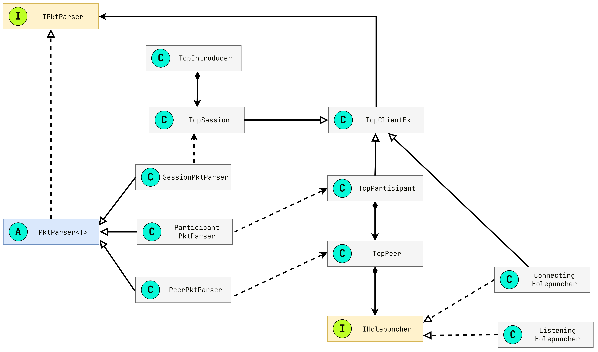

## 1. <a href="#_1" id="li_1">시작 배경과 목표</a>
## 2. <a href="#_2" id="li_2">프로젝트 구조</a>
## 3. <a href="#_3" id="li_3">클래스 구조</a>
## 4. <a href="#_4" id="li_4">실행 방법</a>
1. <a href="#_4_1" id="li_4_1">중개 서버 실행 방법</a>
2. <a href="#_4_2" id="li_4_2">클라이언트 실행 방법</a>
3. <a href="#_4_3" id="li_4_3">홀펀칭 테스트 방법</a>
## 5. <a href="#_5" id="li_5">학습 자료</a>

<br>
<br>
<br>

## 1. 시작 배경과 목표 <a href="#_1" id="_1"></a>

[브라이언 포드의 P2P 번역본](https://github.com/yjd6808/_YJD_BF_p2pnat)을 보고나서 한번 아무런 힌트없이 구현해보고 싶어서 진행한 
프로젝트이다. UDP 홀펀칭조차 구현해본적이 없지만 머릿속으로 견적을 내보니까 구현이 별로 어려워보이지 않아서 TCP 홀펀칭을 구현해보기로 했다. 이걸 제대로 학습해서 내가 원하는 P2P 소프트웨어(게임 혹은 유틸리티)를 개발하고 싶다.

---

<br>

목표1. NAT TCP 홀펀칭 기술을 활용한 P2P 통신을 구현한다.  
목표2. 깔끔한 콘솔 UI를 구성해서 클라이언트는 P2P 연결된 상대 클라이언트 정보를 한눈에 알 수 있도록 한다.  
목표3. 클래스 구조를 설계해서 제대로 동작하든지 말든지 간에 내가 설계한 구조대로 100% 구현해낸다. (실패할 경우 답지를 볼 것)  


<br>
<br>
<br>

## 2. 프로젝트 구조 <a href="#_2" id="_2"></a>

Introducer, Participant, Shared 이렇게 3개의 프로젝트가 있다.  

    Introducer: 중개 서버
    Participant: 클라이언트
    Shared: 공용 라이브러리


<br>
<br>
<br>

## 3. 클래스 구조 <a href="#_3" id="_3"></a>

내가 머릿속으로 제일 처음 떠올린 구조이다.  
전부 만들고나서 이게 완벽하게 "들어맞는" 구조는 아님을 알 수 있었다.  
그래도 내가 생각한대로 100% 동작해서 만족스럽고 TCP 홀펀칭 기술도 구현하는데 지장없는 구조이다.

_TcpPeer, _TcpPariticipant, _TcpSession은 그림이 너무 지져분해져서 기존 클래스명에서 분리해서 표현하였다.





<br>
<br>
<br>

## 4. 실행 방법 <a href="#_4" id="_4"></a>

비주얼 스튜디오 2022 .Net 6.0 기반 프로젝트이다.  

1. Introducer 프로젝트를 빌드 후 EC2같은 가상머신에서 배포 후 실행시키거나 다른 외부망의 컴퓨터에 설치한 후 실행한다.
2. Participant 프로젝트를 빌드해서 서로 다른 컴퓨터에서 실행 한 후 제공하는 커맨드라인을 실행하여 P2P 연결을 시도한다.

<br>
    
    테스트 1. Participant를 2개 같은 컴퓨터에 연결
    테스트 2. Participant를 서로다른 2개의 컴퓨터에서 연결

<br>

### 1. <b>중개 서버 실행 방법</b><a href="#_4_1" id="_4_1"></a>

난 가상머신이 데비안 리눅스 환경이라서 배포할 때 다른 플랫폼에 맞게 새로 빌드를 해줘야한다. 따로 SDK 설치 없이 바로 실행할 수 있도록 --self-contained를 옵션으로 주는게 좋다.

```powershell
dotnet publish -c release -r debian-arm64 --self-contained
```

그리고 생성된 실행 파일을 폴더째로 가상 머신에 배포 후 실행시키면된다.  
실행시킨 후 리스닝할 포트를 입력해준 후의 첫 화면은 아래와 같다.


<br>
<br>


### 2. <b>클라이언트 실행 방법</b><a href="#_4_2" id="_4_2"></a>

실행전에 접속할 중개 서버(introducer) 주소를 Shared/Config.cs 파일에서  
IntroducerEndPoint를 수정 후 빌드해줘야한다.


<br>
<br>

현재 컴퓨터에서 바로 원하는 갯수만큼 실행시키면된다.  
예시로 5개의 Participant를 실행시킨 후 중개 서버와 클라이언트에서 단축키 s를 누르면 다음과 같이 화면에 표시된다.

[좌측: Participant, 우측 Introducer (데비안 리눅스 가상머신)]


<br>
<br>

### 3. <b>홀펀칭 테스트 방법</b><a href="#_4_3" id="_4_3"></a>

위에 나온 화면을 보게되면 클라이언트는 자기 자신을 제외한 나머지 클라이언트 목록정보를 확인할 수 있다. 현재 P2P 연결이 모두 안된 상태이고 중개서버에만 접속한 상태의 클라이언트 들이다.

단축키 D를 눌러서 피어 목록에서 표시된 ID들 중에서   
선택해서 홀펀칭을 수행해주면 된다.  


예를들어서 ID가 5인 클라이언트에서 2번 클라이언트를 대상으로 홀펀칭을 수행한 후 클라이언트 목록을 출력해보면  
아래의 그림과 같은 출력 결과가 나타날 것이다.


<br>
<br>

그리고 이어서 ID가 5인 클라이언트가 4번 클라이언트를 대상으로
홀펀칭을 수행할 경우  
아래의 그림과 같은 출력 결과가 나타날 것이다.


<br>
<br>
<br>
<br>
